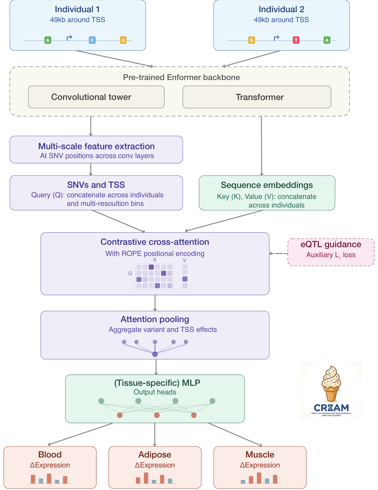

# Contrastive Regulatory Embedding Attention Model (CREAM)
---

Contrastive Regulatory Embedding Attention Model (CREAM) is a computational framework that extends sequence-to-function (S2F) models with customized modules to better isolate cross-individual genetic variation and amplify causal eQTLs signals via an attention mechanism. CREAM can identify tissue-specific eQTLs and predict gene expression across diverse tissues. Furthermore, CREAM can quantify predictive confidence (on *discrete* branch). We demonstrate that quantified predictive uncertainty serves as a proxy for prediction reliability. 


<p align="center">
  
</p>

The main features of **CREAM** include:
1)	**Multiscale Feature Extraction & Contrastive Cross-Attention**: CREAM mitigates downsampling resolution loss by establishing direct connections from intermediate convolutional layers to a customized contrastive cross-attention module. Given a pair of individual genomes, CREAM isolates multiscale genomic bins containing polymorphisms between individuals and contextualizes localized variant queries against global sequence backgrounds.
2)	**eQTL-Guided Inductive Bias**: We introduce an auxiliary loss function that aligns learned attention weights with statistically fine-mapped eQTL effect sizes. This regularization forces the network to prioritize functionally validated regulatory variants over non-causal background variation.
3)	**Uncertainty Quantification**: We reframe expression prediction as a hybrid discrete-continuous distribution task, leveraging Shannon entropy, predictive variance, and cross-run ensemble stability to track prediction reliability and quantify epistemic uncertainty.

## Configuration

Paths, project names and data file names are in [`CREAM/configs/defaults.yaml`](CREAM/configs/defaults.yaml), and every
experiment config in that directory is merged on top of it, so an experiment
config only lists what it changes.

To run on a different machine or checkout, change `paths.project_root` (or
export `CREAM_PROJECT_ROOT`); every other path is resolved relative to it:

```bash
export CREAM_PROJECT_ROOT=/path/to/CREAM
```

Inspect the resolved configuration:

```bash
python -m CREAM.config --config_path CREAM/configs/blood_config_test_run2.yaml   # full config
python -m CREAM.config --get paths.data_dir                            # one value
```

The same configuration is used by python, R and shell scripts: 

- **Python** — `from CREAM import config as cream_config`, then
  `cream_config.load_config(config_path)` and the helpers on that module
  (`data_path`, `gene_set_path`, `donor_list_path`, `run_dir`, `wandb_project`, …).
- **Shell** — `source scripts/cream_env.sh` exports `CREAM_PROJECT_ROOT`,
  `CREAM_DATA_DIR`, `CREAM_RESULTS_DIR`, `CREAM_LOG_DIR`, `CREAM_VENV` and
  `CUBLAS_WORKSPACE_CONFIG`. Slurm writes stdout/stderr relative to
  the directory you submit from, so create the log directories once:

  ```bash
  mkdir -p logs/train/slurm_stdout logs/test/slurm_stdout
  ```

- **R** — `source("Rscripts/config.R"); cream <- cream_config()` gives the same
  resolved paths (`cream$data_dir`, `cream$results_dir`, `cream$eqtl_dir`,
  `cream$genomic_intervals_file`, etc.).

Settings worth knowing about in `defaults.yaml`:

| Key | What it controls |
| --- | --- |
| `paths.project_root` | Root every relative path is resolved against |
| `paths.data_dir` / `paths.test_data_dir` | Input data; `--use_test_data` switches to the latter |
| `paths.results_dir` / `paths.test_results_dir` | Where runs write checkpoints and predictions |
| `paths.eqtl_dir` | Fine-mapped eQTL sets used when `eQTL_guided` is on |
| `data.*` | Data directory layout, file names and the donor/consensus filename templates |
| `outputs.*` | Run directory template and the ISM / evaluation output subdirectories |
| `wandb.*` | Weights & Biases entity and logs |
| `env.venv` / `env.*` | Virtualenv the slurm scripts activate, and their log directories |

## Installation

CREAM runs on Python 3.12 with PyTorch 2.3.1. 

### Virtual environment

```bash
python -m venv .venv                        # any Python 3.12 interpreter
.venv/bin/pip install --upgrade pip
.venv/bin/pip install -r requirements.txt
.venv/bin/pip install -e .
```

`pip install -e .`  installs
`CREAM` as an editable package, so `import CREAM` resolves to this checkout from
any working directory instead of only from the repository root. Confirm both the
package and its Enformer backbone are visible:

```bash
.venv/bin/python -c "import CREAM, enformer_pytorch; print(CREAM.__file__)"
```

### Conda (optional)

`install_reqs.sh` builds a conda environment, named by `env.conda_env`.

```bash
bash install_reqs.sh
```

### VS Code

`.vscode/settings.json` selects `.venv` as the interpreter and adds the
`enformer-pytorch` checkout to `python.analysis.extraPaths`. That second setting
exists because both editable installs use the PEP 660 import hook, which Pylance
cannot follow, without it the editor flags `enformer_pytorch` as unresolved even
though it imports correctly at runtime.

## Running on the test data

`--use_test_data` swaps `paths.data_dir` for `paths.test_data_dir` (`testdata/`)
and `paths.results_dir` for `paths.test_results_dir` (`testresults/`), leaving
every other setting untouched. It is a smoke test: the fixture is small enough to
train in a couple of minutes on one GPU, while still exercising dataset
construction, contrastive cross-attention, the eQTL-guided loss and
checkpointing.

```bash
.venv/bin/python CREAM/train_gtex2.py \
    --config_path CREAM/configs/blood_config_test_run2.yaml \
    --fold 0 \
    --model_type MultiGene \
    --num_gpus 1 \
    --use_test_data
```

The launch configuration *"Python Debugger: train GTEX test run with Arguments"*
runs the same thing under the VS Code debugger. Prefix the command with
`WANDB_MODE=offline` to keep smoke runs out of the W&B project.

### Discrete-continuous training

The continuous model predicts one expression value per gene and tissue. The
discrete-continuous model instead predicts a distribution over expression bins
together with an offset from each bin's centre, which is what makes the
uncertainty quantification possible: the predicted expression is the
expectation `Σ pₖ · (meanₖ + offsetₖ)`, and the same distribution yields Shannon
entropy and predictive variance.


Two config keys:

| Key | What it controls |
| --- | --- |
| `discretize_bins` | Number of expression categories. Must equal the number of bin means — 9 for normalized expression. The model raises on a mismatch rather than failing later on a shape error. |
| `bin_offset_alpha` | Split between the two loss terms: `alpha · offset MAE + (1 - alpha) · bin cross entropy`. Defaults to 0.9. |

The bin edges themselves are defined at the top of `lit_model_cat.py` — Gaussian
quantiles for normalized expression.
Pass `expr_bin_edges` / `expr_bin_means` to the model to use your own, keeping
`discretize_bins` as the number of bins.


```bash
.venv/bin/python CREAM/train_gtex2_cat.py \
    --config_path CREAM/configs/blood_config_test_cat.yaml \
    --fold 0 \
    --model_type MultiGene \
    --num_gpus 1 \
    --use_test_data
```

The launch configuration *"Python Debugger: train GTEX discrete test run with
Arguments"* runs the same thing under the VS Code debugger.

`load_callbacks` selects `MetricLogger_cat` whenever `discretize_bins > 0`. 
`CrossIndivMetrics_*.csv` gains an `accuracy` column alongside
the usual `pearsonr` and `r2`, which are computed from the expectation above.

There is no discrete counterpart
to `test_gtex.py` yet, so held-out evaluation still runs through the training loop.

## Slurm jobs

The batch scripts activate the virtual environment, reading its location
from `env.venv` by way of `scripts/cream_env.sh`:

```bash
source "$(dirname "${BASH_SOURCE[0]}")/../scripts/cream_env.sh"
source "$CREAM_VENV/bin/activate"
```

Point `env.venv` elsewhere to run jobs against a different environment. One
caveat: a virtual environment is a thin layer over the interpreter it was built
from, so that interpreter has to stay reachable from the compute nodes.
`.venv/pyvenv.cfg` records which one it is.

### Test data

`testdata/` is a
chr22-only slice of the real inputs, covering two donors, 8 train genes and 2 validation and test genes:

| Path | Contents |
| --- | --- |
| `ConsensusSeqs_SNPsOnlyUnphased/` | Simulated chr22 haplotypes for GTEX-113JC and GTEX-11DXX with random inserts SNPs on train/val/test genes |
| `predicted_gene_expression/` | chr22 normalized simulated expression for blood, muscle and adipose |
| `genes/MultiGene/egenes/` | 8 train / 2 valid / 2 test chr22 eGenes, as ENSG ids |
| `cross_validation_folds/gtex/cv_folds/` | fold 0 donor lists |
| `Gencode.v46.TSSCentered_49K_Intervals.csv` | chr22 rows of the interval table |

`blood_config_test_run2.yaml` is shaped around that fixture. It sets
`eQTL_guided: 1` and reads fine-mapped eQTLs from `paths.eqtl_dir`, which sits outside `data_dir`. 
It trains on three tissues, but a single tissue works too. 
